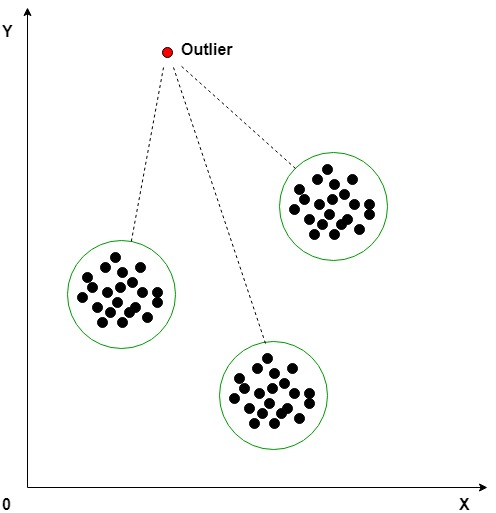

## [scikit-learn支援的演算法 2. Unsupervised learning](https://scikit-learn.org/stable/unsupervised_learning.html)
- 2.1. Gaussian mixture models
- 2.2. Manifold learning|Nonlinear dimensionality reduction | NLDR [WIKI](https://en.wikipedia.org/wiki/Nonlinear_dimensionality_reduction)
  - NLDR refers to various related techniques that aim to project high-dimensional data onto lower-dimensional latent manifolds, with the goal of either visualizing the data in the low-dimensional space, or learning the mapping (either from the high-dimensional space to the low-dimensional embedding or vice versa) itself.
  - NLDR can be understood as generalizations of linear decomposition methods used for dimensionality reduction, such as singular value decomposition(SVD) and principal component analysis(PCA).
  - 範例[Manifold learning on handwritten digits: Locally Linear Embedding, Isomap…](https://scikit-learn.org/stable/auto_examples/manifold/plot_lle_digits.html) 
  - 教學影片[Introduction to Machine Learning - 11 - Manifold learning and t-SNE]()
  - 哈佛大學論文 [The Mathematical Foundations of Manifold Learning()| Luke Melas-Kyriazi](https://arxiv.org/abs/2011.01307)
- 👍2.3. Clustering
- 2.4. Biclustering: Spectral Co-Clustering | Spectral Biclustering
- 👍2.5. [Decomposing signals in components (matrix factorization problems)](https://scikit-learn.org/stable/modules/decomposition.html)
  - Principal component analysis (PCA) | Kernel Principal Component Analysis (kPCA)|Truncated singular value decomposition and latent semantic analysis
  - Dictionary Learning | Factor Analysis |Independent component analysis (ICA) | Non-negative matrix factorization (NMF or NNMF) |Latent Dirichlet Allocation (LDA)
- 2.6. Covariance estimation
- 👍[2.7. Novelty and Outlier Detection](https://scikit-learn.org/stable/modules/outlier_detection.html)
- 2.8. Density Estimation
- 👍2.9. Neural network models (unsupervised)

# [Anomaly detection](https://en.wikipedia.org/wiki/Anomaly_detection)|  Novelty Detection | Outlier Detection 孤立子偵測 

  - Local Outlier Factor (LOF) 2000
    - 論文 [LOF: Identifying Density-Based Local Outliers ](https://www.dbs.ifi.lmu.de/Publikationen/Papers/LOF.pdf) 
    - [機器學習_學習筆記系列(96)：區域性異常因子(Local Outlier Factor)](https://tomohiroliu22.medium.com/%E6%A9%9F%E5%99%A8%E5%AD%B8%E7%BF%92-%E5%AD%B8%E7%BF%92%E7%AD%86%E8%A8%98%E7%B3%BB%E5%88%97-96-%E5%8D%80%E5%9F%9F%E6%80%A7%E7%95%B0%E5%B8%B8%E5%9B%A0%E5%AD%90-local-outlier-factor-a141c2450d4a)
    - 官方範例[Outlier detection with Local Outlier Factor (LOF)](https://scikit-learn.org/stable/auto_examples/neighbors/plot_lof_outlier_detection.html#:~:text=The%20Local%20Outlier%20Factor%20(LOF,lower%20density%20than%20their%20neighbors.))
  - 孤立森林(Isolation Forest)2008 
    - [論文](https://cs.nju.edu.cn/zhouzh/zhouzh.files/publication/icdm08b.pdf?q=isolation-forest)
    - [WIKI](https://en.wikipedia.org/wiki/Isolation_forest) 
    - [sklearn.ensemble.IsolationForest](https://scikit-learn.org/stable/modules/generated/sklearn.ensemble.IsolationForest.html)
      - from sklearn.ensemble import IsolationForest
      - X = [[-1.1], [0.3], [0.5], [100]]
      - clf = IsolationForest(random_state=0).fit(X)
      - clf.predict([[0.1], [0], [90]])
    - [Anomaly detection using Isolation Forest – A Complete Guide](https://www.analyticsvidhya.com/blog/2021/07/anomaly-detection-using-isolation-forest-a-complete-guide/)
  - PyOD套件 2019
    - [PyOD: A Python Toolbox for Scalable Outlier Detection]()  
  - ADBench 2022
    - [ADBench: Anomaly Detection Benchmark(2022)](https://arxiv.org/abs/2206.09426)  [GITHUB](https://github.com/Minqi824/ADBench)
# 深度學習
- GAN 
- 自動編碼器（Autoencoder）與 VAE
- 其他
  - 自組織對映演算法（SOM） 

# 學習資源
- [ Introduction to Machine Learning — Dmitry Kobak, 2020/21 |Tübingen Machine Learning](https://www.youtube.com/playlist?list=PL05umP7R6ij35ShKLDqccJSDntugY4FQT)
- 👍[tomohiroliu22/Machine-Learning-Algorithm](https://github.com/tomohiroliu22/Machine-Learning-Algorithm)
# 非監督學習(參考資訊)
- [Hands-on Unsupervised Learning Using Python](https://www.oreilly.com/library/view/hands-on-unsupervised-learning/9781492035633/) 
  - [GITHUB](https://github.com/aapatel09/handson-unsupervised-learning)
  - 繁體中譯本 [非監督式學習｜使用 Python](https://www.tenlong.com.tw/products/9789865024062?list_name=srh)
  - 👍[使用Google Colab建立測試環境](./GoogleColabUsage.md)
- [Hands-On Unsupervised Learning with Python(2019)](https://www.packtpub.com/product/hands-on-unsupervised-learning-with-python/9781789348279)
  - 簡體中譯本 [Python 無監督學習](https://www.tenlong.com.tw/products/9787115540720?list_name=srh)
  - [GITHUB](https://github.com/PacktPublishing/Hands-on-Unsupervised-Learning-with-Python)
- [Applied Unsupervised Learning with Python](https://www.packtpub.com/product/applied-unsupervised-learning-with-python/9781789952292)
  - t-Distributed Stochastic Neighbor Embedding (t-SNE)
  - Topic Modeling
  - Market Basket Analysis
  - Hotspot Analysis 
- [The Unsupervised Learning Workshop(2020)](https://www.packtpub.com/product/the-unsupervised-learning-workshop/9781800200708) [GITHUB](https://github.com/PacktWorkshops/The-Unsupervised-Learning-Workshop)

