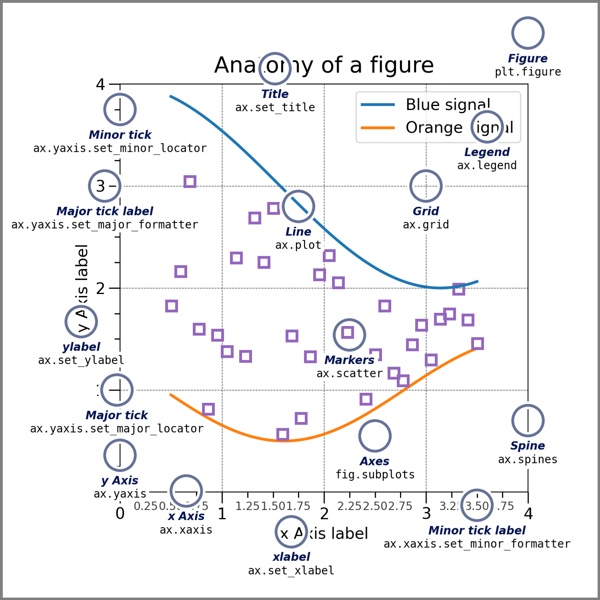

# Matplotlib: Visualization with Python
- [matplotlib](https://matplotlib.org/)
- [Documentation](https://matplotlib.org/stable/index.html)
- [Tutorials]()
- [Example gallery](https://matplotlib.org/stable/gallery/index.html)

## [Quick start guide](https://matplotlib.org/stable/tutorials/introductory/quick_start.html)
```python
import matplotlib as mpl
import matplotlib.pyplot as plt
import numpy as np

fig, ax = plt.subplots()  # Create a figure containing a single axes.
ax.plot([1, 2, 3, 4], [1, 4, 2, 3])  #
```

- [matplotlib.pyplot.subplots](https://matplotlib.org/stable/api/_as_gen/matplotlib.pyplot.subplots.html)
  - 輸入參數 ==> 請參看網址說明
  - 回傳結果(Returns): 
    - fig Figure
    - ax Axes or array of Axes

－統計圖之折線圖　[matplotlib.pyplot.plot](https://matplotlib.org/stable/api/_as_gen/matplotlib.pyplot.plot.html)
  -

## MAtplotlib


## 
```python
fig = plt.figure()  # an empty figure with no Axes

fig, ax = plt.subplots()  # a figure with a single Axes

fig, axs = plt.subplots(2, 2)  # a figure with a 2x2 grid of Axes

# a figure with one axes on the left, and two on the right:
fig, axs = plt.subplot_mosaic([['left', 'right-top'],['left', 'right_bottom']])
```


## 統計圖之scatter plot(散布圖)
```python
np.random.seed(19680801)  # seed the random number generator.
data = {'a': np.arange(50),
        'c': np.random.randint(0, 50, 50),
        'd': np.random.randn(50)}
data['b'] = data['a'] + 10 * np.random.randn(50)
data['d'] = np.abs(data['d']) * 100

fig, ax = plt.subplots(figsize=(5, 2.7), layout='constrained')
ax.scatter('a', 'b', c='c', s='d', data=data)
ax.set_xlabel('entry a')
ax.set_ylabel('entry b')
```
- layout='constrained'
  - [受約束的佈局輔助線](https://www.osgeo.cn/matplotlib/tutorials/intermediate/constrainedlayout_guide.html)
  - [Constrained Layout Guide](https://matplotlib.org/stable/tutorials/intermediate/constrainedlayout_guide.html)
- 統計圖之scatter plot [散布圖](https://zh.wikipedia.org/wiki/%E6%95%A3%E5%B8%83%E5%9C%96)
  - [matplotlib.pyplot.scatter](https://matplotlib.org/stable/api/_as_gen/matplotlib.pyplot.scatter.html) 

## 統計圖之error bar(誤差棒|誤差線|誤差條)
- [matplotlib.pyplot.errorbar](https://matplotlib.org/stable/api/_as_gen/matplotlib.pyplot.errorbar.html)
```python
import numpy as np
import matplotlib.pyplot as plt

fig = plt.figure()

x = np.arange(10)
y = 2.5 * np.sin(x / 20 * np.pi)

yerr = np.linspace(0.05, 0.2, 10)

plt.errorbar(x, y + 3, yerr=yerr, label='both limits (default)')

plt.errorbar(x, y + 2, yerr=yerr, uplims=True, label='uplims=True')

plt.errorbar(x, y + 1, yerr=yerr, uplims=True, lolims=True,
             label='uplims=True, lolims=True')

upperlimits = [True, False] * 5
lowerlimits = [False, True] * 5
plt.errorbar(x, y, yerr=yerr, uplims=upperlimits, lolims=lowerlimits,
             label='subsets of uplims and lolims')

plt.legend(loc='lower right')
```
- [matplotlib.pyplot.legend](https://matplotlib.org/stable/api/_as_gen/matplotlib.pyplot.legend.html)
  - loc ==> 'upper left', 'upper right', 'lower left', 'lower right' 

##
```python


```


##
```python


```


##
```python


```


##
```python


```


##
```python


```
